# ProjectKeeper

**Your agents wrote the code. ProjectKeeper tells you what was actually planned, decided and done.**

A resident agent that reads your project as it is and keeps a browsable picture of it.

English · [简体中文](README.zh-CN.md)

[](LICENSE)

[](https://github.com/feiyanglyy-stack/ProjectKeeper/actions/workflows/ci.yml)


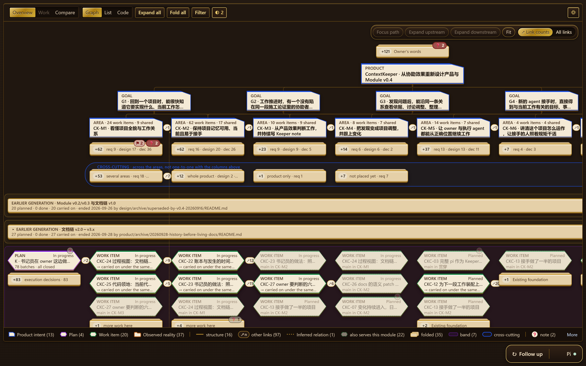

*One real project on one screen: what the owner asked for, the goals and product areas, two earlier plans, and the current plan's work. Every object opens to its sources.*

## Why

Three weeks into a project built with coding agents, you have twenty-odd sessions behind you, forty tickets, and a plan that was rewritten twice. You come back on a Monday and cannot say which decisions still hold, what was really finished and what was only reported finished, or what was quietly dropped along the way. The answers exist — in documents, commit messages and session logs nobody will read again. ProjectKeeper reads them, on your machine, and keeps the result where you can browse it.

## What you get

- **The whole project on one map.** What you said you wanted, the goals, the product areas, the plans, and each piece of work in its place.
- **What really happened to each piece of work.** Its steps — dispatched, delivered, reviewed, fixed, merged — each with the commit, report or verdict it rests on, and marked `Inferred` where the Keeper inferred it.
- **Where a decision came from.** Your own words, quoted verbatim with the session they were said in, and the documents and commits that carried the decision on.
- **What became of old plans.** Every item of an earlier plan with what happened to it: carried on, moved, deferred or dropped.
- **What needs you.** Notes that ask for your decision and give options, and send-backs — a review that failed and nobody picked up — ready to copy to an agent.
- **The right context for the next agent.** One command gives an agent the pack for a work item: what it serves, how it got here, your project's rules, where the code is.

And it stays current: after the takeover, a round runs on the schedule you set, or when you press `Follow up`.

## After one pass

The first pass reads the documents, the git history, the code structure and your agent sessions, and fills three views.

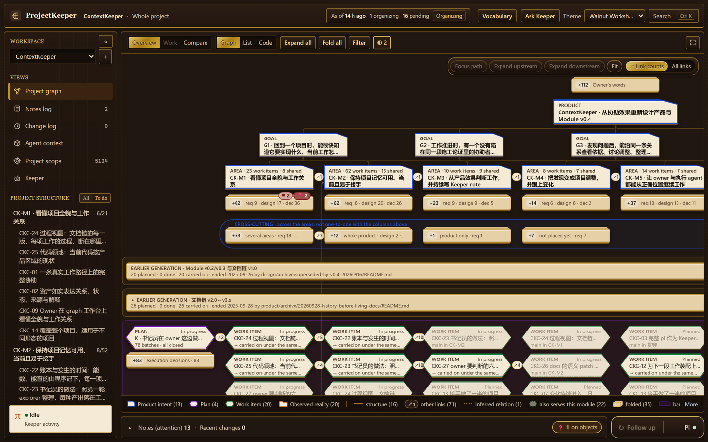

*Graph: your words and the product on top, goals and areas across, earlier plans rolled up, the current plan's work in its cells.*

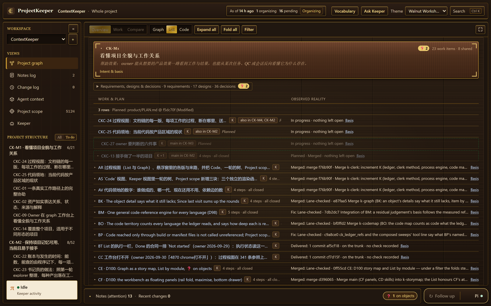

*List: one area opened. What was planned is on the left; what actually happened is on the right — in progress, merged in which commit, delivered with no check recorded.*

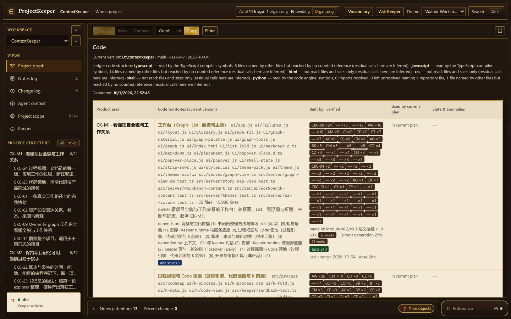

*Code: which code belongs to which product area, which pieces of work built it, how many tests it has, and whether the current plan still uses it.*

**Measured:** this pass took about 50 minutes and about 11 CNY (about $1.5) on DeepSeek. The project is ProjectKeeper's own working repository: about 1,000 files of documents and code (some 470 Markdown documents and 400 source files, about 217,000 lines), about 750 commits and 22 agent sessions.

## After a deepening

A deepening digs the history by question and checks its own work. On the same project it took another 71 minutes.

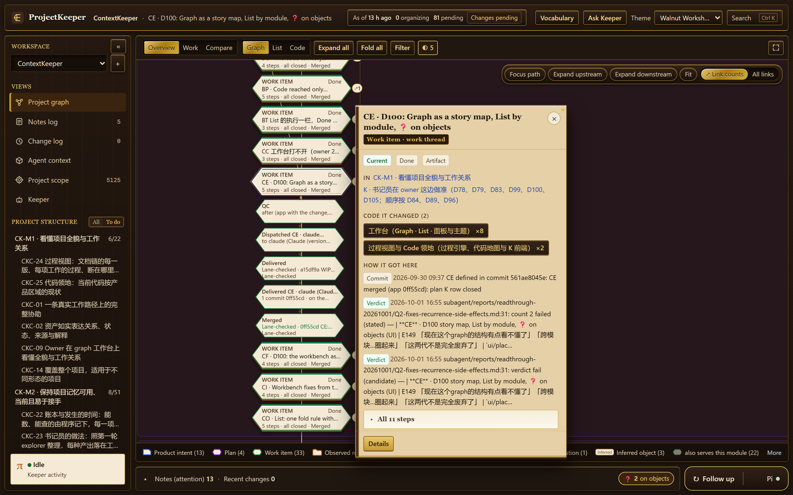

*A piece of work with its steps under it — checked, dispatched, delivered, merged — and beside it the code it changed and the commits and review verdicts it came through.*

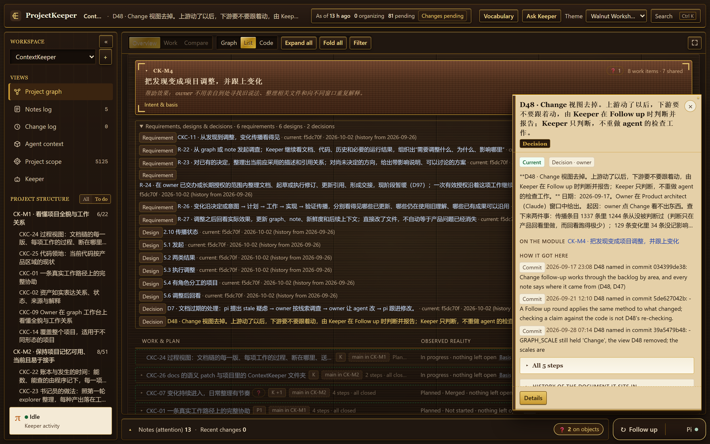

*Where a decision came from: an area's requirements, designs and decisions in one list, and for the one you click, when it was made and the commits that carried it.*

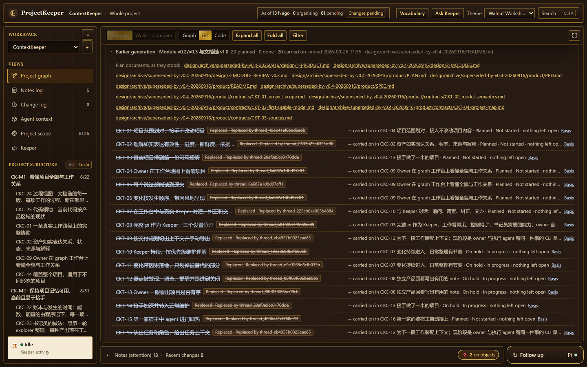

*What became of an old plan: every item of an earlier generation, struck through, with the current item that carried it on.*

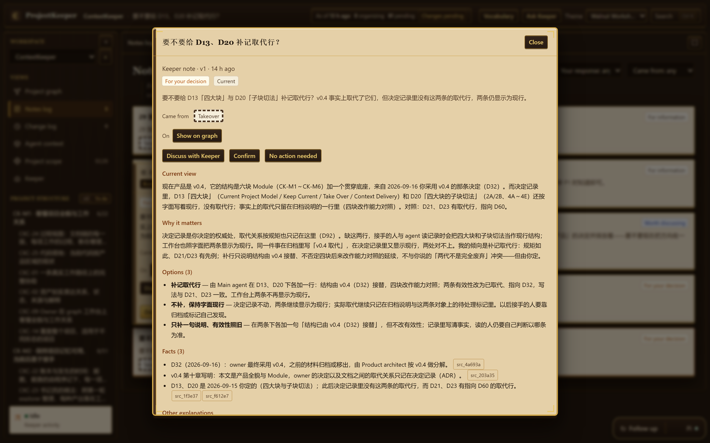

*A note that needs you: the question, the Keeper's view, why it matters, three options with what follows from each, and the facts with their sources.*

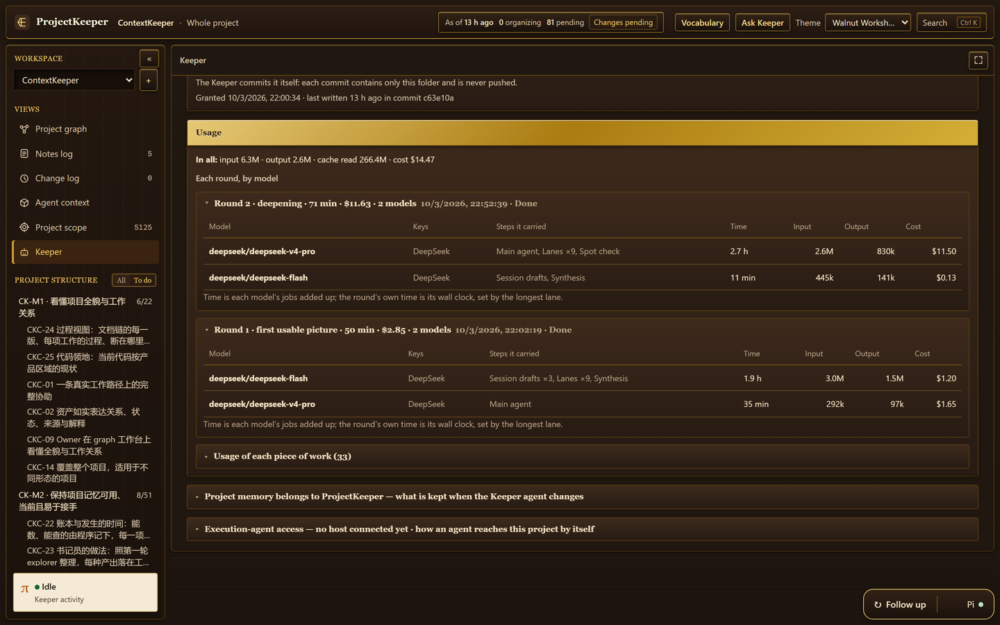

*What each round used and which model carried which steps. The dollar figure is an estimate at list prices; the bill for this run was lower (see [What a run costs](#what-a-run-costs)).*

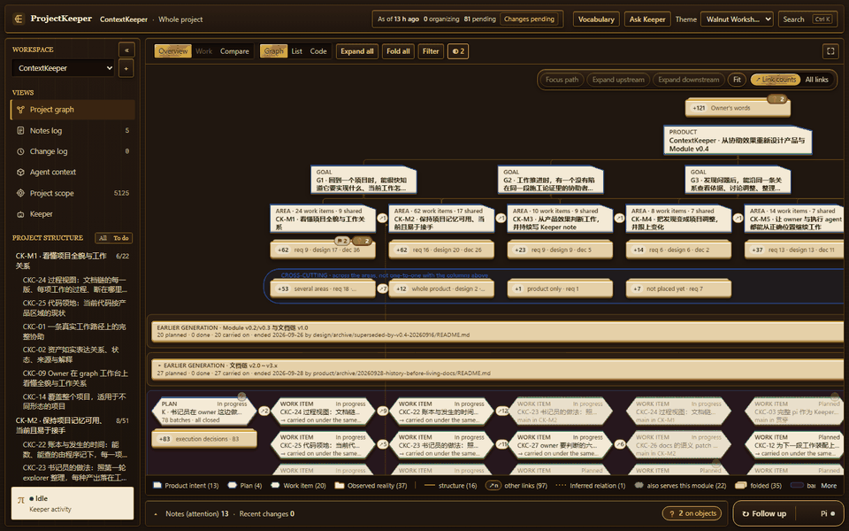

*From the map to one piece of work, to what happened to it, to the code it changed.*

## See it without a key

```sh
npm run demo
```

This builds an invented project — Papertrail, a one-person read-later list — already organized, and serves it at `http://127.0.0.1:4880/`. No key, no model, no network; the Keeper's answers in the demo are canned. Everything it writes goes into one folder in your temporary directory.

## Quick start

You need Node.js 24 or later, and git.

```sh
git clone https://github.com/feiyanglyy-stack/ProjectKeeper.git && cd ProjectKeeper
npm ci
npm start
```

Open `http://127.0.0.1:4870/`. Then four clicks:

1. **Add project** — a name and the folder of your project. Nothing runs yet.
2. **Add a key** — on the Keeper page that opens, under `Model provider`: choose the provider, paste the key, `Save`.
3. **Choose a depth** — `Full`, `Focused` or `First picture only`.
4. **Start.**

The first picture comes first; the deepening follows if you chose one. Details: [Getting started](docs/getting-started.md).

## Models and keys

You bring your own key. The model library underneath ([pi](https://github.com/earendil-works/pi)) lists some forty providers; the ones actually run so far are **DeepSeek** (`deepseek-v4-pro`, `deepseek-flash`) and **Zhipu GLM** (`glm-5.3`, `glm-5.3-flash`). A key you save stays on your machine, in ProjectKeeper's own folder, and is never shown again. Each step of a round can run on its own model, and backup keys take over when one runs out of quota: [Models and keys](docs/models-and-keys.md).

## What a run costs

A full takeover (the first pass and a full deepening) of the project above, measured four times:

| Models | Time | Cost |
|---|---|---|
| DeepSeek: flash for everything, pro for the final check | 126 min | 29 CNY billed (about $4) |
| DeepSeek: pro as main agent and for the deepening's sub-agents, flash for the rest | 122 min | 57 CNY billed (about $8) |
| Zhipu GLM-5.3 as main agent, GLM-5.3-flash for the rest | 198 min | $19 at list price |
| Zhipu GLM-5.3 for everything | 200 min | $67 at list price |

These are four runs on one project: a loose comparison, not a benchmark. The program changed between the runs (the GLM runs are the older ones), and the main agent of the all-flash run had read the previous run's list of faults in the project it was organizing.

- **The first pass alone** on DeepSeek: about 50 minutes and about 11 CNY with pro as main agent, or about 10 CNY all on flash.
- **GLM on a Coding Plan subscription** costs far less than the list price. In the maintainer's own terms: a GLM-5.3 first pass is about half of a junior team seat's 5-hour quota, a deepening about one 5-hour quota, a daily follow-up barely moves the quota, and an all-flash run about a third of one 5-hour quota.
- **The Usage page is an estimate.** It applies a list-price table to the recorded tokens; on the DeepSeek run with pro it showed $14.48 where the account was charged 57 CNY.

What each run got right and what it missed: [Cost and quality](docs/cost-and-quality.md).

## What it does not do, and privacy

- **It does not change your project's files.** It writes to its own home folder (`~/.projectkeeper`). Inside your project it writes one folder of its own, and only after you authorize it.
- **It listens on `127.0.0.1` only.** No account, and no telemetry of its own.
- **What leaves your machine** is what goes to the model provider you chose: prompts that contain text from your project — documents, code, commit messages, and what you said in your agent sessions.
- **It does not write code, run your tests or manage tickets.** It reads, and tells you what it found, with the source of each statement.

More in [Privacy](docs/privacy.md).

## For your agents: `pk`

Agents read the same picture through a command while the workbench is running. Two real outputs from the demo project, shortened where `…` stands:

```text
$ pk context --work T-18
# Context for Incoming agent · Work: T-18 Search index incremental rebuild 增量重建 · Kind: Implement
…
## Owner's words
What the owner said that this work traces up to, word for word:
- `ow_save_fast` · the owner, 2026-09-09 [1]:
  “Saving has to be faster than deciding where it goes”
…
## Open problems
- The receipt claims a one-minute background refresh; the code does not have it.
- Is the one-minute refresh claim measured anywhere?
…
```

```text
$ pk get sb_search_refresh
# Send-back · sb_search_refresh
Where: Search index incremental rebuild 增量重建 (thread_search_index)
What: Batch 2 says the index refreshes every minute; the review could not confirm it from the code, and batch 2 was signed off anyway.
Send back to: Work · Reopen T-18: make the index refresh in the background, or correct the receipt.
Status: Suggested · Open
…
```

All of it, and how to run these against the demo: [The `pk` command](docs/pk.md).

## How it works

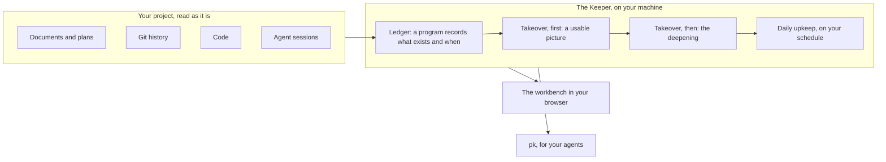

A program first records what exists and when — every commit, document version, number and session — without a model. Then one main agent sends sub-agents to answer questions against that ledger, a separate session writes the notes for you, and an independent check re-reads what was concluded. What a program can count or check, the program does; the model's attention goes to judgement. More: [How the Keeper works](docs/how-the-keeper-works.md).

## How it compares

Tools that draw a graph of code structure, such as Understand-Anything, show how the code hangs together; ProjectKeeper's map is of intent and work — what was wanted, planned and done — with the code attached to the product areas it serves. Session-memory tools such as claude-mem capture what agents do from the day you install them; ProjectKeeper takes over what already exists, history included. Spec and task tools such as OpenSpec or Backlog.md work when you and your agents write in their format; ProjectKeeper asks you to write nothing new. It reads what the project already has and keeps it for a person to browse and for agents to query.

## Status and limits

- **v0.1.** It makes mistakes, and it differs from run to run; every statement links to its source so you can check it. The measured runs, and what each missed, are in [Cost and quality](docs/cost-and-quality.md).
- **Developed and run on Windows.** macOS and Linux are untested.
- **It reads sessions from Claude Code and Codex.** Other agents' sessions are not read yet.
- **The interface is English; the content is in your project's language.** The screenshots are from a Chinese-language project.
- **The name.** ProjectKeeper was developed under the working name ContextKeeper, and the screenshots show it organizing its own project, which carries that name.

## Documentation

[Getting started](docs/getting-started.md) · [Concepts](docs/concepts.md) · [Models and keys](docs/models-and-keys.md) · [How the Keeper works](docs/how-the-keeper-works.md) · [Cost and quality](docs/cost-and-quality.md) · [The `pk` command](docs/pk.md) · [Privacy](docs/privacy.md) · [FAQ](docs/faq.md) · [Architecture](docs/architecture.md)

## Contributing

Issues and pull requests are welcome: [CONTRIBUTING.md](CONTRIBUTING.md). Changes are listed in [CHANGELOG.md](CHANGELOG.md).

## Licence

MIT — see [LICENSE](LICENSE). The themes under `ui/themes/` are not covered by it: [ui/themes/LICENSE.md](ui/themes/LICENSE.md). Third-party material: [THIRD_PARTY_NOTICES.md](THIRD_PARTY_NOTICES.md).

Built with [Claude Code](https://claude.com/claude-code).
