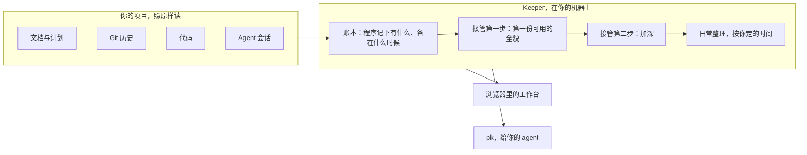

# ProjectKeeper

**代码是 agent 写的。当初计划了什么、定了什么、实际做完了什么，ProjectKeeper 告诉你。**

一个常驻的 agent：项目做到一半也能接手，照它本来的样子读一遍，画成一张随时能翻的图。

- **以你说过的话为准。** 你的原话一字不改地留着，带着是在哪段会话里说的。文档和你的话对不上了、你要的东西半路没了、多出了你没要过的工作，ProjectKeeper 都会告诉你。
- **做到一半的项目，随时能交接。** 把它指向项目文件夹：文档、git 历史、代码和 agent 会话整理成一张图；一条命令，就把某项工作的上下文交给下一个 agent。

[English](README.md) · 简体中文

[](LICENSE)

[](https://github.com/feiyanglyy-stack/ProjectKeeper/actions/workflows/ci.yml)


*一个真实项目，一屏看完：owner 要的是什么、目标和产品区域、两代旧计划、现行计划里的工作。每个对象点开都能看到出处。*

## 为什么要有它

用 coding agent 做了三个星期的项目：二十几段会话，四十张工单，计划重写过两回。周一回来，你说不清哪些决定还算数，哪些工作是真做完了、哪些只是「汇报说做完了」，又有哪些需求在半路上悄悄没了。答案其实都在——在文档里、提交说明里、没人会再翻的会话记录里。ProjectKeeper 就在你自己的机器上把它们读一遍，整理成你能翻着看的样子。

## 你能得到什么

- **整个项目在一张图上。** 你说过想要什么、目标、产品区域、计划，每一项工作各在其位。
- **每项工作到底经过了什么。** 派出、交付、审查、修复、合并，每一步都带着它依据的提交、报告或判定；Keeper 自己推断的标 `Inferred`。
- **一个决定是怎么来的。** 你的原话，一字不改，带着是在哪段会话里说的；还有把这个决定落下去的文档和提交。
- **旧计划后来怎么样了。** 上一代计划里的每一项各有去向：接着做了、挪走了、推后了，还是放弃了。
- **哪些事要你拿主意。** 需要你决定的 note 会给出几个选项；审查没过、又没人接的事（送回）可以直接复制给 agent。
- **给下一个 agent 的上下文。** 一条命令，就把某项工作的上下文交给它：这项工作为了什么、怎么走到今天、你这个项目的规矩、代码在哪。

而且它会一直跟着：接管完之后，按你定的时间每天整理一轮，或者你按一下 `Follow up`。

## 跑完第一遍

第一遍读文档、git 历史、代码结构和你的 agent 会话，填出三个视图。


*Graph：最上面是你的原话和产品，横着是目标和区域，旧计划收成横条，现行计划的工作落在各自的格子里。*


*List：展开一个区域。左边是计划了什么，右边是实际发生了什么——进行中、在哪个提交里合并了、交付了但没有检查记录。*


*Code：哪块代码属于哪个产品区域、是哪些工作做出来的、有多少测试、现行计划还用不用它。*

**实测：** 这一遍用 DeepSeek 跑了大约 50 分钟，花了大约 11 元人民币（约 1.5 美元）。被整理的项目就是 ProjectKeeper 自己的工作仓库：文档加代码大约 1,000 个文件（约 470 份 Markdown 文档、400 个源码文件，约 21.7 万行），大约 750 次提交，22 段 agent 会话。

## 加深之后

加深是带着问题去挖历史，并且自己查一遍自己的结论。同一个项目上，加深又用了 71 分钟。


*一项工作，下面挂着它的步骤——检查、派出、交付、合并；旁边是它改过的代码，以及它经过的提交和审查判定。*


*一个决定是怎么来的：一个区域的需求、设计和决定列在一起；点开其中一条，能看到它是哪天定的、哪些提交把它落了下去。*


*旧计划后来怎么样了：上一代的每一项都划掉了，旁边写着现在是哪一项接着在做。*


*要你拿主意的 note：问的是什么、Keeper 怎么看、为什么要紧、三个选项各自会带来什么，以及带出处的事实。*


*每一轮用了多少、哪个模型承担了哪些步骤。图上的美元数是按标价估的，这一轮实际扣的钱比它少（见[跑一轮要花多少](#跑一轮要花多少)）。*


*从地图，到一项工作，到它经过了什么，再到它改了哪些代码。*

## 不用 key 先看看

```sh
npm run demo
```

它会生成一个虚构的项目——Papertrail，一个人用的稍后读清单——已经整理好，在 `http://127.0.0.1:4880/` 打开。不需要 key，不调模型，不联网；demo 里 Keeper 的回答是预先写好的。它写的东西都在系统临时目录下的一个文件夹里。

## 快速开始

需要 Node.js 24 及以上，以及 git；系统是 Windows 或 macOS。在 Mac 上，git 随 Xcode 命令行工具安装（`xcode-select --install`）；Homebrew 的 `node` 比这里测试过的 24 要新：见 [Mac 上需要什么](docs/getting-started.md#on-a-mac)。

```sh
git clone https://github.com/feiyanglyy-stack/ProjectKeeper.git && cd ProjectKeeper
npm ci
npm start
```

打开 `http://127.0.0.1:4870/`，然后点四下：

1. **Add project**——起个名字，填上项目所在的文件夹（直接输入路径，或点 `Browse…` 从列表里选）。这时什么都还没开始跑。
2. **加一把 key**——在随后打开的 Keeper 页上，`Model provider` 里：选服务商，粘贴 key，`Save`。
3. **选一个深度**——`Full`、`Focused` 或 `First picture only`。
4. **Start。**

先出第一份可用的全貌；选了加深的话，接着做加深。细节见 [Getting started](docs/getting-started.md)。

## 模型与 key

key 你自己带。底下的模型库（[pi](https://github.com/earendil-works/pi)）列了四十来家服务商，我们实际跑过的是 **DeepSeek**（`deepseek-v4-pro`、`deepseek-flash`）和**智谱 GLM**（`glm-5.3`、`glm-5.3-flash`）。你保存的 key 只留在本机 ProjectKeeper 自己的文件夹里，保存之后界面上不会再显示。一轮里的每一步可以各用各的模型；一把 key 额度用完了，备用的 key 会接上：见 [Models and keys](docs/models-and-keys.md)。

## 跑一轮要花多少

上面那个项目，完整接管（第一遍加一次完整加深）一共实测了四次：

| 模型搭配 | 用时 | 花费 |
|---|---|---|
| DeepSeek：全用 flash，最后的抽查用 pro | 126 分钟 | 实扣 29 元（约 4 美元） |
| DeepSeek：主 agent 和加深的子 agent 用 pro，其余用 flash | 122 分钟 | 实扣 57 元（约 8 美元） |
| 智谱 GLM-5.3 做主 agent，其余用 GLM-5.3-flash | 198 分钟 | 按标价 19 美元 |
| 全用智谱 GLM-5.3 | 200 分钟 | 按标价 67 美元 |

这是同一个项目上的四次运行，只能粗略横向比一比，不是评测。几次运行之间程序改过（两次 GLM 是较早的版本）；全 flash 那一次的主 agent，还在它整理的项目里读到了上一次运行的问题清单。

- **只跑第一遍**，用 DeepSeek：大约 50 分钟；pro 做主 agent 约 11 元，全用 flash 约 10 元。
- **GLM 如果用的是 Coding Plan 订阅**，实际花费远低于标价。按维护者自己的说法：GLM-5.3 跑第一遍，大约用掉团队初级成员 5 小时额度的一半；加深大约用掉一个 5 小时额度；每天的 follow up 基本看不出额度变化；全用 flash 的话，整个跑完大约是一个 5 小时额度的三分之一。
- **Usage 页上的金额是估算。** 它拿记录下来的 token 数去乘一张标价表；用 pro 的那次 DeepSeek 运行，页面显示 14.48 美元，账户实际扣了 57 元。

每一次跑对了什么、漏了什么：见 [Cost and quality](docs/cost-and-quality.md)。

## 它不做什么，以及隐私

- **它不改你项目里的文件。** 它只写自己的文件夹（`~/.projectkeeper`）。在你的项目里，它只写一个属于它自己的文件夹，而且要你先授权。
- **只监听 `127.0.0.1`。** 不用账号，自己也不传任何遥测。
- **会离开你机器的东西**，是发给你所选模型服务商的内容：提示词里带着你项目的文字——文档、代码、提交说明，以及你在 agent 会话里说过的话。
- **它不写代码，不跑你的测试，也不管工单。** 它只读，然后把读到的告诉你，每句话都带出处。

更多见 [Privacy](docs/privacy.md)。

## 给你的 agent：`pk`

工作台开着的时候，agent 可以用一条命令读到同一份全貌。下面是 demo 项目上两段真实的输出，`…` 处有省略：

```text
$ pk context --work T-18
# Context for Incoming agent · Work: T-18 Search index incremental rebuild 增量重建 · Kind: Implement
…
## Owner's words
What the owner said that this work traces up to, word for word:
…
- `ow_search_fast` · the owner, 2026-09-16 [2]:
  “搜索要在一秒内出结果，不然我不会用”
…
## Open problems
- The receipt claims a one-minute background refresh; the code does not have it.
- Is the one-minute refresh claim measured anywhere?
…
```

```text
$ pk get sb_search_refresh
# Send-back · sb_search_refresh
Where: Search index incremental rebuild 增量重建 (thread_search_index)
What: Batch 2 says the index refreshes every minute; the review could not confirm it from the code, and batch 2 was signed off anyway.
Send back to: Work · Reopen T-18: make the index refresh in the background, or correct the receipt.
Status: Suggested · Open
…
```

全部用法，以及怎样对着 demo 跑这些命令：见 [The `pk` command](docs/pk.md)。

## 它是怎么工作的



先由程序把「有什么、各在什么时候」记成账本——每次提交、每个文档版本、每个编号、每段会话——这一步不用模型。然后一个主 agent 带着问题派子 agent 去账本和材料里找答案；另开一段会话替你写 note；最后一道独立的抽查把结论重新核一遍。程序数得清、查得了的，都交给程序；模型的注意力留给判断。详见 [How the Keeper works](docs/how-the-keeper-works.md)。

## 和同类工具比

画代码结构图的工具（比如 Understand-Anything）告诉你代码之间怎么连；ProjectKeeper 画的是意图和工作——想要什么、计划了什么、做了什么——代码挂在它服务的产品区域下面。会话记忆类工具（比如 claude-mem）从装上那天起记录 agent 做的事；ProjectKeeper 接手的是已经存在的一切，连同历史。规格和任务类工具（比如 OpenSpec、Backlog.md）要你和 agent 按它们的格式来写；ProjectKeeper 不要你多写任何东西。它读项目里本来就有的材料，整理出来给人翻，也给 agent 查。

## 现状与局限

- **v0.1。** 它会出错，同一个项目每次跑出来也不完全一样；每句话都连着出处，你可以自己核对。四次实测以及各自漏了什么，见 [Cost and quality](docs/cost-and-quality.md)。
- **Windows 和 macOS。** ProjectKeeper 是在 Windows 上做出来的，也每天在 Windows 上用。它也能在 macOS 上运行：测试套件在 GitHub 的 macOS 运行器上通过，但还没有人在 Mac 上日常用过，难免有粗糙的地方——欢迎告诉我们它在你的 Mac 上表现如何。Linux 暂不支持。
- **Mac 上的文件名。** 只差大小写的两个名字，或者只差 Unicode 写法的两个名字（带重音的字母、韩文、日文假名的合成与分解两种形式），ProjectKeeper 都当作同一个名字，和 Mac 常用的卷一样。如果卷被格式化成区分大小写的，这样的两个文件会被当成一个。
- **路径很长的项目。** 项目里再深的文件都能读。但在 Windows 上，项目自身的路径有上限，git 和 Windows 的长路径设置都解除不了：超过 246 个字符，git 打不开这个仓库（文件照读，历史读不到，`Project scope` 里会写明）；超过 251 个字符，Keeper 无法在这个目录里工作。请把这样的项目挪到短一些的路径下。
- **会话只读 Claude Code 和 Codex 的。** 其他 agent 的会话暂时不读。
- **界面是英文的，内容跟着你项目的语言走。** 截图来自一个中文项目。
- **名字。** ProjectKeeper 开发期间的名字是 ContextKeeper；截图里它整理的正是它自己的项目，那个项目用的还是这个名字。

## 文档

文档目前只有英文：[Getting started](docs/getting-started.md) · [Concepts](docs/concepts.md) · [Models and keys](docs/models-and-keys.md) · [How the Keeper works](docs/how-the-keeper-works.md) · [Cost and quality](docs/cost-and-quality.md) · [The `pk` command](docs/pk.md) · [Privacy](docs/privacy.md) · [FAQ](docs/faq.md) · [Architecture](docs/architecture.md)

## 参与

欢迎提 issue 和 pull request：见 [CONTRIBUTING.md](CONTRIBUTING.md)。版本变化记在 [CHANGELOG.md](CHANGELOG.md)。

## 许可证

MIT，见 [LICENSE](LICENSE)。`ui/themes/` 下的主题不在这份许可证之内：见 [ui/themes/LICENSE.md](ui/themes/LICENSE.md)。第三方材料：[THIRD_PARTY_NOTICES.md](THIRD_PARTY_NOTICES.md)。

使用 [Claude Code](https://claude.com/claude-code) 构建。
