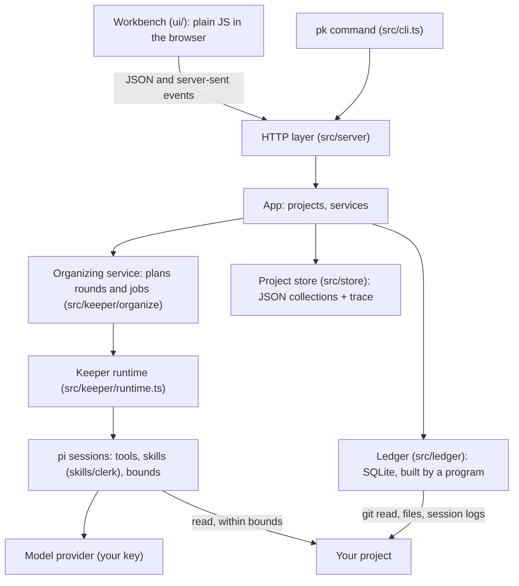

# Architecture

For contributors, and for anyone who wants to know what is running on their machine. [How the Keeper works](how-the-keeper-works.md) covers the method; this page covers the code.

## At a glance

- **One Node.js process** serves the workbench on `127.0.0.1`, runs the Keeper's jobs, and watches the projects for change.
- **No build step.** The server is TypeScript that Node 24 runs directly (type stripping); the browser side is plain JavaScript modules. `tsc` is used only to typecheck.
- **No database server.** Per project: JSON files for the picture, one SQLite file for the ledger.
- **The agent runtime is [pi](https://github.com/earendil-works/pi).** ProjectKeeper gives it tools, skills and bounds; pi talks to the model providers.



## Folders

| Folder | What is in it |
|---|---|
| `bin/` | `pk.mjs`, the command's entry in plain JavaScript; `postinstall.mjs`, which applies the patch |
| `src/cli.ts` | the `pk` command: `serve`, `add`, `projects`, `scope`, and the agent's `context`, `get`, `options`, `ask`, `help` |
| `src/server/` | the HTTP layer, the routes, and the views the workbench reads (the map, the List, the round tree, the Keeper page) |
| `src/scope/` | working out what belongs to a project: repositories, worktrees, ignored and third-party material, where its sessions are |
| `src/sources/` | reading files, git and session logs; watching for change |
| `src/intake/` | taking the scope's material in as sources, and keeping an honest record of what was read |
| `src/ledger/` | the ledger: commits, document versions, numbering, verdicts, code structure, sessions (see below) |
| `src/process/` | computed from the ledger without a model: each work item's steps, breakpoint candidates, send-backs, earlier generations, placement |
| `src/codemap/` | the Code view's counts: which work built which code, tests, dependencies, current use |
| `src/keeper/` | the runtime on pi, the Keeper's tools, the bounds on what it reads and writes, keys and routing, the conversation |
| `src/keeper/organize/` | rounds: the planner, the stages and their gates, lanes, coverage, the schedule, the takeover |
| `src/context/` | assembling context packs and the text `pk get` prints |
| `src/store/` | the per-project JSON store, saved versions for `Compare`, the workspace file |
| `src/model/` | types and the fixed vocabulary |
| `skills/clerk/` | one skill per stage of a round: what the model is told to do at that stage |
| `ui/` | the workbench: `index.html`, plain JavaScript modules, CSS, the themes |
| `scripts/` | the demo and its seed, the patch installer, browser checks of the UI, replay tools |
| `patches/` | the patch to pi's model library, with its notes |

Tests sit beside the code as `*.test.ts` and run with Node's own test runner: no network, no keys.

## The home folder

Everything ProjectKeeper keeps is under `~/.projectkeeper` (`PROJECTKEEPER_HOME` overrides it):

```text
workspace.json            the projects and the machine's settings (port, main model, backups)
keys.json                 keys saved from the workbench
projects/<project id>/
  nodes.json, relations.json, reference.json, threads.json, …   the picture, one file per collection
  notes.json, changes.json, breakpoints.json, sendbacks.json    what the Keeper wrote and what was computed
  sources.json            what each statement cites, with excerpts
  jobs.json, rounds.json, clerkRounds.json, roundDocs.json      the rounds: steps, briefs, reports, results
  trace.jsonl             every write, with its basis
  ledger.sqlite           the ledger
  code-index/             snapshots and indexes of the code engine
  versions/               saved versions of the picture, for Compare
```

Files are written atomically. The store emits change events, which the server forwards to open pages over server-sent events, so the workbench updates while a round runs.

## The ledger

The ledger is the part that makes the rest checkable. A program builds it from git, the files and the session logs — no model, no network, git only read — and rebuilds it incrementally on a worker thread at the start of every round. It records:

- every commit, its parents, what it changed, whether it is on the trunk, and which merge brought it in;
- every version of every document, with its sections and what each version added, removed or changed — including documents since deleted;
- the numbers the project gives things, where each is defined and where it is mentioned;
- explicit supersessions ("replaced by …") and verdicts written in reports;
- the code: files, languages, references between files, tests, and which commits wrote which lines;
- the agent sessions and what the owner said in them;
- a full-text index over all of it.

TypeScript and JavaScript are read with the TypeScript compiler. Every other language is read by a general code engine (the `@colbymchenry/codegraph` package), run in a child process over a snapshot ProjectKeeper keeps beside the ledger; it writes nothing into the project.

The Keeper's tools query the ledger and cite its entries by id. Queries go through read-only connections that a rebuild never blocks.

## pi as the runtime

Each model job — a session draft, the main agent, a lane, the synthesis, the spot check, a conversation turn — runs in its own pi session with the project folder as its working directory. ProjectKeeper adds:

- **Tools** (`pk_*`) to query the ledger, write objects with sources, move between stages, send lanes, and record checks. Each writer refuses outside the stage that owns it.
- **Skills** (`skills/clerk/`), one per stage, returned to the model when it enters the stage.
- **Bounds** (`src/keeper/bounds/`): which paths a read may reach, a parser that checks shell commands before they run, and an undo journal for writes into the project.
- **Routing** (`src/keeper/route.ts`): which key and model each step runs on, and the order of backups.

A job interrupted by a rate limit, a spent quota or a restart is reopened from its saved session.

### The patch

`npm ci` applies a small patch to the installed copy of pi's model library (`pi-ai`); it checks versions and file hashes first and fails loudly on a mismatch. It does two things:

- **Streaming.** While a tool call's arguments stream in, they are re-parsed at doubling lengths instead of on every chunk, so a long argument costs linear rather than quadratic time.
- **Complete arguments only.** If a tool call's arguments do not arrive as complete JSON, the call is marked and refused before any tool runs; upstream would complete the fragment and run it, which can save a truncated file.

[patches/README.md](../patches/README.md) has the detail. Upgrading pi means reviewing the patch.

## The workbench

`ui/index.html` loads plain JavaScript modules; there is no framework and no bundler. The map is drawn with cytoscape and dagre, served from `node_modules` under `/vendor/`. The page loads nothing from outside the machine. Every view reads a JSON route and re-reads it on a change event.

## The demo

`npm run demo` (`scripts/demo.ts`) builds the invented Papertrail project with its git history and two worktrees, seeds a home with an organized picture, and serves it with a local stand-in for the model provider. It runs with an empty pi folder and with key-like environment variables removed, so nothing of yours is read.

## Tests and checks

```sh
npm run typecheck     # tsc, no output files
npm test              # node --test over src/**/*.test.ts
```

The suite has about 1,130 tests and takes about two minutes on the machine it was developed on. The scripts under `scripts/ui-*-check.mjs` drive a real headless Chrome against a served fixture and measure the page; they need Chrome installed (`CHROME_PATH` names it) and are not part of `npm test`.
