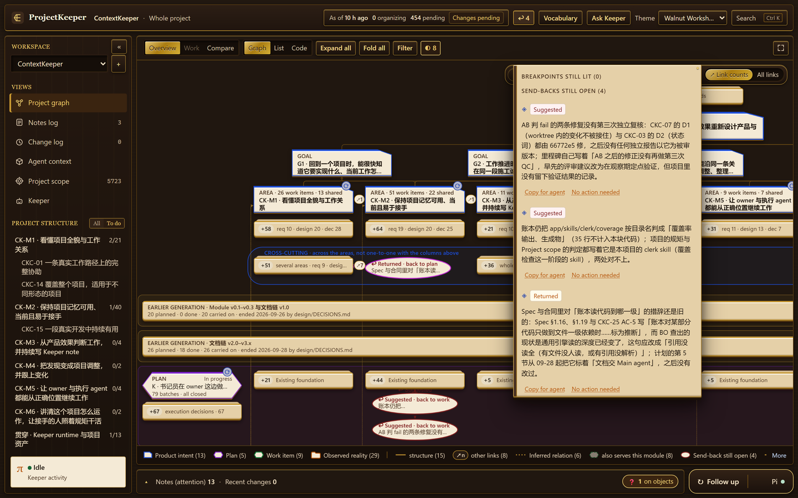

# Concepts

The words the workbench uses, and what each one helps you see. The same vocabulary is used for every project; the objects keep your project's own names and numbers. In the workbench, **Vocabulary** in the top bar gives the formal definitions, in English or Chinese.

## The picture in one paragraph

At the top is what you said you wanted (**Owner's words**), the **Product** and its **Goals**. Under them are the product's **Areas**, each with its requirements, designs and decisions. Below are the **Plans**, and in each plan's row the **Work items**, placed under the area they serve. Each work item carries the **steps** that actually happened to it. At the foot of each area is what exists: code, commits, results. Everything is drawn from your project's material, and every object opens to the lines it came from.

## Product intent

| Word | What it is |
|---|---|
| **Owner's words** | What you said, or explicitly confirmed, in a session: one point per item, quoted word for word, with where you said it. An agent's restatement does not count unless you confirmed it. |
| **Product** | The one description of the whole product: what it is, for whom, and its parts. |
| **Goal** | Why the product exists; what a user should get. |
| **Area** | A part of the product: a module, a feature, or a theme the Keeper grouped work under when the project names no modules. |
| **Requirement** | What the product must do, as the project states it. |
| **Design** | How it is meant to be built or to behave. |
| **Decision** | Something decided, or a constraint to respect. A decision you stated that no document records is marked as undocumented. |

Quoted words are checked by the program against the source they cite: a quote with a word added, changed or silently left out is refused.

## Work and plan

| Word | What it is |
|---|---|
| **Plan** | A plan, milestone or phase: what comes in which order. |
| **Work item** | One piece of work: a task, a contract, an issue, a ticket. Work items come from your project's own plan; a session or a commit never becomes one by itself. |

### The steps of a work item

A work item shows what happened to it, in the order it happened, with the evidence for each step:

| Step | Taken from |
|---|---|
| `Planned` | the version of the plan it entered |
| `Dispatched` | the prompt or run that handed it to an agent |
| `Delivered` | its own commits, branch and receipts — a receipt's account is a claim, not a fact |
| `QC`, `Review`, `Walkthrough` | a check's report, with the verdict as written |
| `Fix` | work that fixes this work after a check |
| `Merged` | the merge that brought its commits into the trunk |
| `Accepted` | your acceptance, where the project records one |

No step is added that your project does not have. Beside the steps, each work item shows four things at a glance: who carried it out, its progress, whether it was checked, and what is still open.

*A work item's steps on the map, and the commits and verdicts they rest on.*

### Earlier generations

Projects built with agents rewrite their plans. When a plan was replaced by a new one, the old one is an **earlier generation**: it is rolled up into a band on the map, and each of its items shows what became of it — carried on in a current item, moved, deferred or dropped.

*An earlier generation: every item struck through, with the current item that carried it on.*

## Where the flow broke

### Breakpoints

A **breakpoint** is a place where the next step should be there and has no trace. It is an observation on an object, not a ticket: later evidence puts it out by itself.

| Breakpoint | On | Means |
|---|---|---|
| `Not planned` | your words, requirements | nothing downstream reaches a plan or a work item |
| `Not started` | planned work | its batch started; it has no dispatch, branch or commit |
| `Not merged` | work that says it is done | its commits are not on the trunk |
| `No trace of done` | work reported done | no commit and no product of its own |
| `Not checked` | work your rules say is checked | no independent check at all |
| `Findings open` | a check's findings | no fix, send-back or disposition afterwards |
| `Passed with open items` | a check that passed | it left items for later that nothing followed up |
| `Fix not re-checked` | a fix your rules say is re-checked | no check after the fix |
| `No plan` | work merged into the trunk | it traces to no plan, decision or words of yours |
| `Downstream behind` | something downstream of a superseded version | it still cites what was superseded |
| `Not carried out` | a decision with a date or precondition | due, and no later trace |

Whether a step is due follows your project's own rules; ProjectKeeper adds no steps to a project. The program computes **candidates**. A candidate is lit only after a sub-agent looked for the missing step and did not find it, and the round's independent check confirmed that. The first pass lights none. `No action needed` from you turns one off for good.

### Send-backs

A **send-back** is something that should go back: to the work (reopen it, or open new work) or to the plan. It is a relation, not a ticket, and it moves by itself:

- `Suggested` — a check failed or a review sent a delivery back, or the Keeper suggests it from a breakpoint or a code anomaly.
- `Returned` — a later task, commit or document version picked it up.
- `Closed` — later evidence shows it fixed.

Each open send-back has **Copy for agent**: the problem, the evidence lines, and what to do, as text you can hand to an agent.

*Send-backs still open, from the top bar: each with its reason, `Copy for agent` and `No action needed`.*

### The six things

Six kinds of trouble that the round judges for you, each tagged on the objects it concerns:

1. **Stale** — something still describes what has been superseded.
2. **Drift** — your words and a document have drifted apart.
3. **Dropped along the way** — something wanted that was taken out, or never reached a plan, and that nothing since covers.
4. **Grown by itself** — a requirement or work that traces to nothing you asked for.
5. **Let pass** — findings left open, checks passed with open items, fixes not re-checked.
6. **Looks residual** — code that looks left over, from the code territories' anomalies.

## Notes

A **note** is what the Keeper writes to you. A note is never a decision. Each is marked with what it asks of you:

- **For your decision** — with the Keeper's view, why it matters, options with what follows from each, and the facts with their sources.
- **Worth discussing**.
- **For information**.

You answer with `Discuss with Keeper`, `Confirm` or `No action needed`. A later round gives every standing note a result: confirmed, updated or withdrawn.

## Code territories

In the `Code` view the current code is divided into **territories**, each under the product area it serves. For each: its files and lines, the work items that built it (from the commits on the trunk), its tests, whether the current plan still uses it, and anomalies such as code nothing references. The counts are made by a program from the code and the history; no model writes a number.

## Words that qualify everything

| Word | Values | Meaning |
|---|---|---|
| **Basis** | `Explicit` / `Inferred` | `Explicit`: your project wrote it. `Inferred`: the Keeper concluded it from the material; the object says `Inferred`, and an inferred relation is a dotted line. |
| **Validity** | `Current` / `Proposed` / `Deferred` / `Replaced` / `Abandoned` / `Removed` | Whether it is in force. `Replaced` points at what replaced it. |
| **Progress** | `Planned` / `In progress` / `Done` / `On hold` | As your material reports it. Code existing does not make work `Done`; when evidence contradicts the report, the report stays and the contradiction is marked. |

## Sources, changes and marks

- **Sources.** Every statement cites the document section, commit, code location or session passage it came from. `Basis` on a row opens them.
- **Change records.** Written only when meaning or state changed: a decision made, replaced or abandoned; work completed or stopped; a correction from you. Not one per commit. Objects new or changed since your last visit carry a star.
- **Project scope.** What the Keeper treats as the project — repositories, worktrees, directories, session logs — each with the reason, and what it leaves out as third-party or generated.
