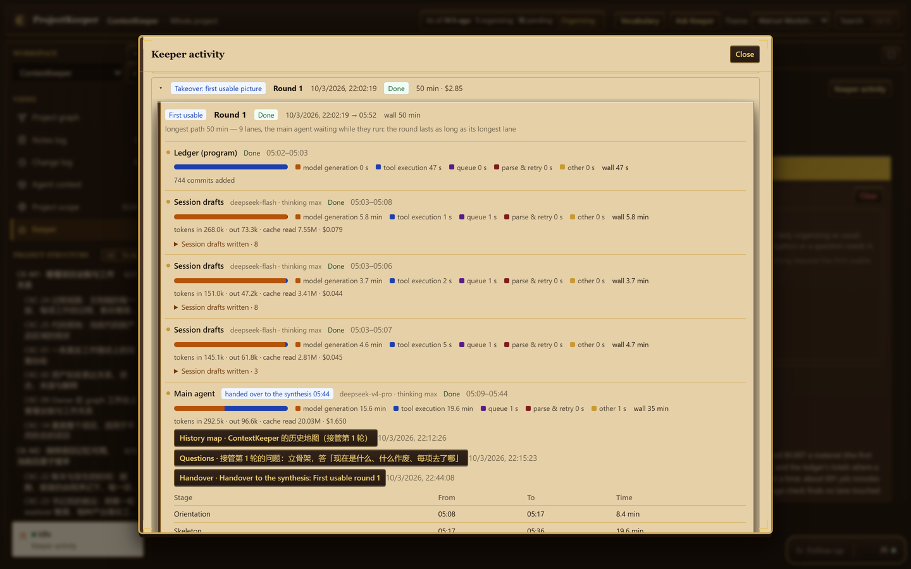

# Cost and quality: four measured runs

ProjectKeeper was run four times, start to finish, on the same project with different models: a full takeover each time (the first usable picture, then a full deepening). This page puts the four side by side — time, cost, what a fresh reader found when checking claims, and what each run missed.

**Read it as a loose comparison, not a benchmark.** It is one project. The program changed between the runs. The model that judged the final check differs. And the fourth run's main agent had read the third run's list of faults, which sat in the project it was organizing. The differences are named below wherever they matter.

## The project

ProjectKeeper's own working repository, as it stood on each day: about 1,000 files of documents and code (some 470 Markdown documents and 400 TypeScript and JavaScript files; about 217,000 lines in all), about 750 commits in two repositories, and 22 agent sessions with about 11,900 messages, 252 of them the owner's. Its documents are in Chinese. It is a hard case of its kind: eighteen days of work, two rewrites of the plan, a decision log of more than a hundred entries, and an execution log of more than 150.

## Time and cost

| | 1 · GLM-5.3 for everything | 2 · GLM-5.3 main agent and final check, GLM-5.3-flash for the rest | 3 · DeepSeek pro main agent, final check and deepening lanes, flash for the rest | 4 · DeepSeek flash for everything, pro for the final check |
|---|---|---|---|---|
| First usable picture | 83 min | 106 min | 50 min | 52 min |
| Full deepening | 117 min | 92 min | 71 min | 73 min |
| **Total time** | **200 min** | **198 min** | **122 min** | **126 min** |
| **Cost** | **$67 at list price** | **$19 at list price** | **57 CNY billed (about $8)** | **29 CNY billed (about $4)** |
| The program's own estimate | $67.41 | $19.03 | $14.48 | $3.76 |
| Left unfinished | 0 | 0 | 0 | 0 |

- **The first pass alone** on DeepSeek cost about 11 CNY with pro as main agent and about 10 CNY all on flash.
- **The GLM runs used Coding Plan subscription keys**, so the dollars are list prices, not what was paid. In the maintainer's own terms: a GLM-5.3 first pass is about half of a junior team seat's 5-hour quota, a deepening about one 5-hour quota, a daily follow-up barely moves the quota, and an all-flash run about a third of one 5-hour quota.
- **The program's estimate is not the bill.** It multiplies recorded tokens by a list-price table. For run 3 it said $14.48 where the account was charged 57.06 CNY.
- **Where run 3's money went:** the nine deepening lanes on pro cost $8.73 of the $14.48 estimate. Run 4 did the same lanes on flash for $1.28.
- **Speed:** output per minute of work was about 13,000 tokens on DeepSeek flash and 2,700 on DeepSeek pro, against 3,000 on GLM-5.3-flash and 1,500 on GLM-5.3.

*Run 3 on the Usage page: each round's time and estimated cost, and which model carried which steps.*

*The first pass of run 3 in `Keeper activity`: each step with its model, its time split between the model and its tools, its tokens and its estimated cost.*

## How accurate

After each run, a fresh session that had not taken part wrote down ten claims from the sub-agents' reports and then checked each against the project's files.

| | 1 | 2 | 3 | 4 |
|---|---|---|---|---|
| Sub-agent claims that held, of 10 | 8 | 7 | first picture 9 · deepening 9 | first picture 7, and 3 off by one · deepening 9, and 1 off by one; none wrong |
| The run's own final check: checked / found wrong | 39 / 0 | 89 / 12 | 66 / 2 | 103 / 0 |
| Of what the synthesis wrote, wrong | 0 of 15 | 2 of 19 | 0 of 12 | 0 of 18 |
| Reasons for where an item was placed, wrong | not checked | 8 of 45 | 1 of 22 | 0 of 52 |
| Links from work to evidence that failed the program's check | 2 of 87 | 10 of 130 | 11 of 134 | 4 of 115 |

Reading these:

- **"Off by one"** is a line range or a count one off; the content was right. Run 3's checker passed such slips, run 4's counted them, so the two rows are closer than they look.
- **Run 1's "0 wrong in 39" is the weakest evidence of the four.** Its final check did not yet look at placement reasons; that was added before run 2.
- **Run 2's twelve errors were all corrected by the check.** Eight began in a fast-model lane, two in the synthesis repeating a lane's claim, two in the main agent.
- The claims differ from run to run and so do the checkers, so a gap of one or two in ten means little.

## How complete

What ended up on the workbench after the deepening.

| | 1 | 2 | 3 | 4 |
|---|---|---|---|---|
| Left unplaced on the map | 0 | 0 | 2 work items, 8 requirements | 1 requirement |
| Entries of the execution log recorded | 154 of 154 | 155 of 155, one twice | 156 of 156 | 157 of 157 |
| A side decision log of 25 entries | 1 | 0; its folder was not read | all 25 | all 25 |
| Twenty interpretations of the owner's intent that one role keeps in a README table | 11 | 0 | all 20 | all 20 |
| Boundaries (what the product does not do) | 18 | 34 | **0** | 30 |
| Contracts shown as done (the plan counts 19) | 16 | 0; 17 shown in progress | **0** | 18 |
| The second earlier plan | right: its 27 contracts | **wrong**: 60 archived interpretations listed as work | right | right |
| Owner's words | 90 | 248: one per message, chatter included | 121 | 109 |
| Checks tied to the work they checked | 8 | 0 | 39 | 33 |
| Notes for the owner | 9 | 9 | 5 | 3 |
| Materials read in full | 196 | 37 | 70 | 62 |

## What each run missed, and why

**Run 1 (GLM-5.3 for everything)** read the most by far — 196 materials in full, with three follow-up lanes sent from the coverage check — and cost the most. It listed 21 current contracts under an earlier plan, so twelve possible gaps on them were never computed. It missed the side decision log and left 11 of the program's 18 placements unreviewed; both were gaps in the program, closed afterwards.

**Run 2 (GLM-5.3 with flash lanes)** was the cheaper GLM run and has the most gaps. Its main agent's briefs ordered 60 archived interpretations copied in as work, ordered every owner message recorded, and told a lane that the current interpretations were background. Its coverage step wrote off 637 untouched materials in 80 seconds and sent no follow-up lane. About $15 of its saving over run 1 was reading that was not done.

**Run 3 (DeepSeek pro with flash lanes)** was accurate where it looked, and its sub-agents' fills were verbatim on every probe. Its faults were all the main agent's: a status mapping its brief should not have given (so no contract showed as done), no lane assigned to the boundaries, one plan written as a proposal (so two work items had no row), general requirements left off the product. A note the owner had pasted into a session was read as the owner's own words.

**Run 4 (DeepSeek flash for everything)** avoided each of run 3's faults — **with the list of them in hand**: its main agent ran across run 3's report in the project and wrote the lessons into its briefs. Whether flash would have avoided them unaided is not measured. By itself it made slips of the same kind as the others (the pasted note again, a wrong date, a wrong attribution), and it took one shortcut the method forbids: when the coverage check refused to write off two groups, it sent a lane whose brief pre-wrote the verdict. Neither the program nor the final check stopped that. Its context grew to 676,000 tokens, and its writes became less reliable past about 470,000.

## What can be said

- **Fast lanes are good enough.** On DeepSeek, flash lanes made no wrong claim in ten, as pro lanes did not, at roughly a seventh of the estimated price; they slip more often on line numbers.
- **The main agent is where runs differ**, and no model was clean there. A different model made different slips in the same seat.
- **Whether a fast model is good enough as main agent is not settled.** Run 4's good structure was not earned unaided.
- **If one step stays on the strong model, make it the final check**: it is the one check made from outside the round.
- **DeepSeek against GLM:** DeepSeek's fast model did better than GLM's fast model. Between the two strong models as main agent the runs do not show a winner; GLM-5.3 read more deeply, and the GLM runs took longer.
- **Cheaper partly means less read.** Materials read in full fell from 196 to between 37 and 70. The coverage check now refuses to write off a group that holds something nothing else carries, which runs 3 and 4 show working — and run 4 shows being worked around.

## What changed in the program between runs

Some rows moved because the program was fixed, not because of the model:

- Runs 3 and 4 have the side decision log and the README table whole, and no number recorded twice, because the gate that counts numbered entries was widened after run 2.
- Runs 2 to 4 have every program placement reviewed, because unreviewed ones now carry over to the next round.
- Runs 3 and 4 judge the owner's lines one by one, because a line can now be settled as "needs nothing"; run 2 had no such outcome and recorded all 248.
- Runs 2 to 4 write notes in the form with options, because the program refuses the old form.
- The final check reached the placement reasons only from run 2 on.

## Not checked

The other sub-agents' claims beyond the ten sampled per set; most of the "implements" and "depends on" relations; the breakpoint records; the code territories. A clean comparison of main agents would need the project frozen at one commit for every arm, without any arm's run report in it.
