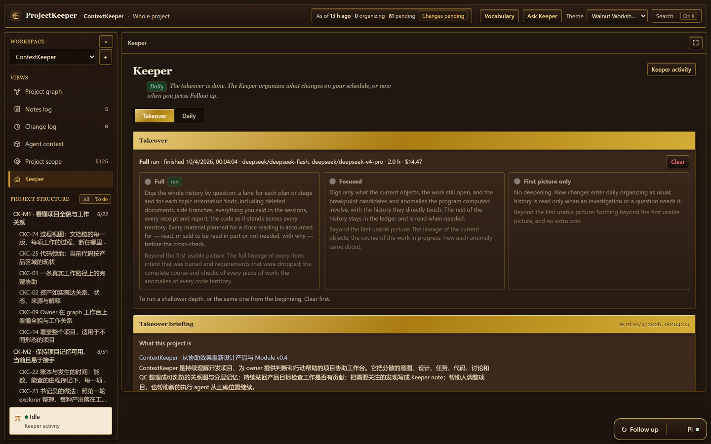
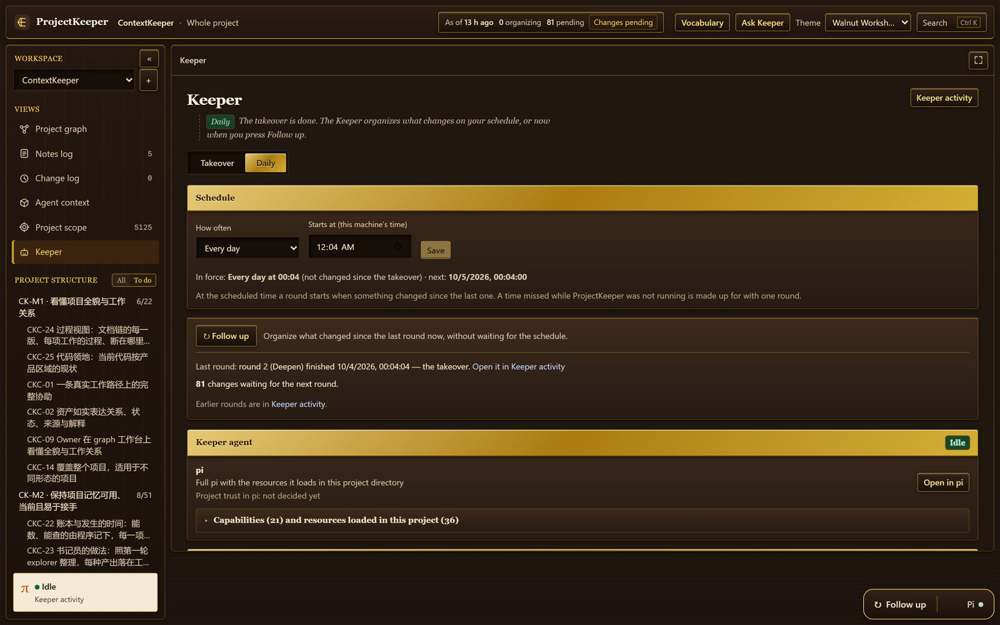

# Getting started

From a fresh clone to an organized project. If you only want to look around first, run the demo: it needs no key.

## What you need

- **Node.js 24 or later**, and **git**.
- **A key for a model provider**, for anything beyond the demo. See [Models and keys](models-and-keys.md).
- **Windows** is where ProjectKeeper has been developed and run. macOS and Linux are untested.

## Install

```sh
git clone https://github.com/feiyanglyy-stack/ProjectKeeper.git && cd ProjectKeeper
npm ci
```

`npm ci` ends by applying a small patch to the installed model library, so that a tool call whose arguments were cut off in transit is refused instead of run ([patches/README.md](../patches/README.md)). If you install with `--ignore-scripts`, run `node bin/postinstall.mjs` yourself.

There is no build step: Node runs the TypeScript sources directly.

## Look at the demo

```sh
npm run demo
```

It builds an invented project called Papertrail, already organized, and serves it at `http://127.0.0.1:4880/`. The address it prints opens the project's map. No key, no model and no network are used, and nothing of your own ProjectKeeper folder, projects or keys is read. `npm run demo -- --port 5000` uses another port; `Ctrl+C` stops it.

## Start the workbench

```sh
npm start
```

The workbench is at `http://127.0.0.1:4870/`. `npm start -- --port 4871` serves it on another port; `Ctrl+C` stops it. It has to be running for rounds to run and for the `pk` command to answer.

## Add your first project

1. Press **Add project**. Give it a name and the folder of your project. If the project has more than one location — worktrees outside the main folder, say — put one on each line.
2. The project opens on its **Takeover** page. Adding a project starts nothing.

From a terminal the same is `npx pk add <name> <folder>`.

## Add a key

On the same page, under **Model provider**: choose the provider, paste the key, press **Save**. The key is checked with one request of one output token and then shown as `Usable`, or with the provider's own words if it was refused.

Under **This project runs on** you choose the main model and how hard it thinks. You can leave the rest as it is; [Models and keys](models-and-keys.md) covers per-step models and backup keys.

## The takeover

Choose a depth, then press **Start**.



*The Takeover page after a full takeover: what ran, on which models, how long, the estimated cost, and the briefing the Keeper wrote.*

| Depth | What it does |
|---|---|
| **Full** | Digs the whole history by question, including deleted documents, side branches, what you said in the sessions, receipts and reports, and the code as it stands. Every material planned for a close reading is accounted for. |
| **Focused** | Digs only what the current objects, the work still open and the anomalies the program computed involve. The rest of the history is read when needed. |
| **First picture only** | No deepening. History is read only when a question needs it. |

Whichever you choose, the **first usable picture** comes first: the product, its areas, the planned work, the map, the code view and a few project-level notes. Then the Keeper goes on to the depth you chose without asking again. On the measured project the first picture took about 50 minutes and a full deepening another 71 ([Cost and quality](cost-and-quality.md)).

While it runs:

- **Keeper activity** shows the round as a tree: each step, each sub-agent, its time and tokens.
- **Project scope** shows what the Keeper took as part of the project, with the reason for each item. If something is ambiguous — a folder your ignore rules leave out that holds documents, for instance — it asks there.
- You can close the browser. The work goes on as long as `npm start` is running; if you stop that, an interrupted step goes on from its own session the next time.

Once a depth has run, a deeper one can go on from what is done. To run a shallower one, or the same one again, **Clear** first.

## Read the result

- **Project graph** has three faces: `Graph` (the map), `List` (area by area, plan against reality) and `Code` (which code belongs to which area).
- **Notes log** holds what the Keeper wrote to you, each note marked for your decision, worth discussing, or for information.
- **Change log** lists what changed in meaning: a decision made or replaced, work completed or stopped.
- **Agent context** prepares the pack an agent gets before it starts; `pk` gives the same from a terminal ([The `pk` command](pk.md)).
- **Vocabulary**, in the top bar, explains every word the workbench uses, in English or Chinese.

[Concepts](concepts.md) explains what you are looking at.

## Keep it current



*The Daily page: when a round starts by itself, and `Follow up` to run one now.*

After the takeover the project is in daily upkeep. On the **Daily** page you set how often a round starts: `Off`, `Every day`, `On selected days`, `Every N days` — each with a time of day — or `Continuous`. Until you change it, a round starts every day at the time of day the takeover finished.

A scheduled round starts only if something changed since the last one. A time missed while ProjectKeeper was not running is made up for with one round. **Follow up** runs a round now.

## A folder of the Keeper's in your project (optional)

Until you say otherwise the Keeper writes nothing into your project. On the **Keeper** page, under **Project folder**, `Authorize…` lets it maintain one folder of its own there — `projectkeeper/` unless you name another — and commit that folder alone; it never pushes. The section shows whether the authorization stands, and `Withdraw` takes it back. What the folder holds: [Privacy](privacy.md).

## Clear

**Clear**, on the Takeover page, removes everything the Keeper organized for the project and puts it back to `Not organized yet`. It asks you to type `DELETE`. Your project's own files and version control are not touched; the project's name, its locations, the schedule and the total of what was spent before stay.

## Where things are kept

Everything ProjectKeeper keeps is in `~/.projectkeeper`: the list of projects, your saved keys, and one folder per project. Set `PROJECTKEEPER_HOME` to keep it somewhere else. Nothing is written into your project unless you authorize it ([Privacy](privacy.md)).
