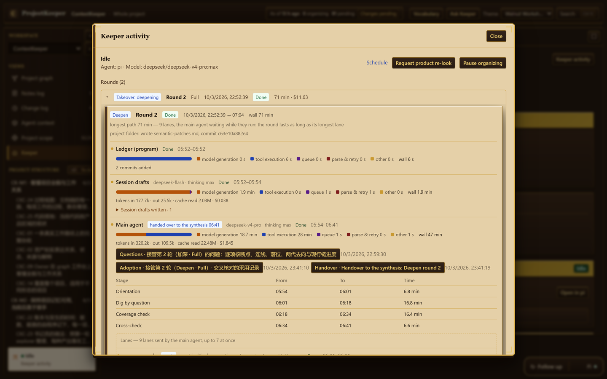
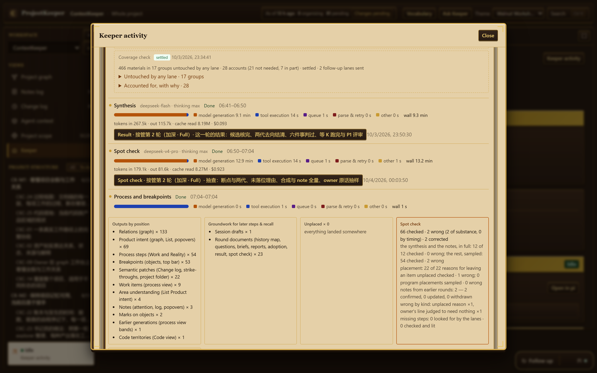

# How the Keeper works

For the curious: what happens between pressing `Start` and reading the map. You do not need any of this to use ProjectKeeper.

## The idea

Reading a project is done the way a careful new colleague would do it: first find out what exists, then ask questions and send people to answer them, then check the answers before writing anything down for the owner.

Two rules shape everything:

- **What a program can count or check, the program does.** Commits, document versions, numbers, dates, who referenced what: a program records them exactly, and no model is asked to remember or re-derive them.
- **The model's attention goes to judgement.** What a document means, which plan a piece of work belongs to, whether a missing step is really missing.

## A round

All work happens in **rounds**. A takeover is one or two rounds; daily upkeep is one round at a time.

| Round | When | Steps |
|---|---|---|
| **First usable picture** | the takeover's first round | ledger → session drafts → main agent → synthesis → process |
| **Deepening** | the takeover's second round, at the depth you chose | ledger → session drafts → main agent → synthesis → spot check → process |
| **Follow up** | on your schedule, or when you press `Follow up` | the same as a deepening, over what changed |

*A deepening in `Keeper activity`: the program's ledger step, the session drafts, and the main agent with the time of each of its stages. Its nine lanes follow below.*

### 1 · The ledger (a program, no model)

The round's first step brings the **ledger** up to date: a local database of what exists and when. It holds every commit and what it changed, every version of every document with its sections, the numbers your project gives things (tickets, decisions, contracts) and where each is defined, verdicts written in reports, the code's files and references, and your agent sessions with what you said in them.

Later steps query it and cite its entries. It states facts, never judgements: "this line reads superseded by X", "no file references this file".

### 2 · Session drafts

A model reads the agent sessions that belong to the project and keeps, for each, what was worked on and **your own words verbatim**, marking the lines where you decided or confirmed something.

### 3 · The main agent and its lanes

One **main agent** carries the round in one session, stage by stage. It reads the ledger and the project's top documents to orient itself; the close reading is done by **lanes** — sub-agents that each answer one question from the material and write their findings with sources. The main agent decides what to adopt.

In a first usable picture:

- **Orientation.** Learn the project's shape from the ledger and the top documents. Decide which document fills which part of the picture. Write the round's questions and one brief per lane.
- **Skeleton.** Send the lanes. Each copies what the documents state — a plan table's rows become work items, a decision log's entries become decisions — before judging anything.
- **Reconcile.** Join what the lanes wrote into one picture. Place every work item in its plan and area, and every decision on what it acts on.

In a deepening:

- **Orientation**, again, from what the first round left open.
- **Dig by question.** Lanes go out by plan or stage and by topic. Together they answer four kinds of question: the owner's meaning; the document chain and decisions; each work item's process and checks; the code as it stands. History is looked up per question, not read version by version.
- **Coverage check.** The program lists the planned materials no lane touched. The main agent accounts for each group — not needed, read in part on purpose, with why — or sends a follow-up lane to read it.
- **Cross-check.** A lane's conclusion is adopted only after checking it against the original, the ledger or the code. Every breakpoint candidate gets a result; every item of an earlier plan gets its destination.

Then it hands the round over, in writing.

### 4 · Synthesis

A **fresh session** — one that was not there for the round — reads the handover and every lane report and writes what you will read: the notes, the send-backs, the judgement of the six things, each area's state, and the round's result. Notes standing from earlier rounds each get a result: confirmed, updated or withdrawn.

It is a separate session on purpose. In an earlier version the main agent, at the end of a long round, wrote notes from memory that the check then had to correct; a fresh reader writes them from the reports.

### 5 · Spot check

In a deepening or a follow-up, an **independent check** runs last. It checks in full what is most likely to be wrong and most costly if wrong — every "this step is missing" conclusion, every reason an item was left unplaced, everything the synthesis wrote, every note current now — and samples the rest. What it finds wrong it corrects in place, and it records every check. A breakpoint is lit only here.

*The end of the same round: what the coverage check accounted for, the synthesis, the spot check with what it found wrong, and where each output landed in the workbench.*

### 6 · Process

A program computes each work item's steps from the ledger and the links the round confirmed, moves the send-backs on, and puts out breakpoints that later evidence has answered.

## The program's own checks

These cost the model nothing and do not depend on its promise:

- **Nothing numbered is lost.** Every number a current decision record, plan, task index or execution arrangement defines must be carried by an object on the workbench, or accounted for by name with a reason. The main agent cannot leave the stage until that holds.
- **Every planned material is accounted for** before a full deepening's cross-check.
- **Quotes are verbatim.** Words recorded as yours must stand in the source they cite; a changed or added word is refused, with a pointer to the passage that does hold it.
- **Evidence resolves.** A link from a work item to a commit is checked when it is written: the commit exists and touches what the link claims. Links that fail are set aside for the cross-check.
- **Placement from the records.** Where the project's own records lead to exactly one plan for a piece of work, the program places it and marks it `Inferred`; a reason for "belongs to no plan" is refused when the records say otherwise.
- **Each stage writes only its own part.** A tool refuses outside the stage that owns it, so one matter is written once.
- **A cut-off tool call is not run.** If a model's tool arguments arrive incomplete, the call is refused and the model is told to send it again.

## What the Keeper can reach

The Keeper is a full coding agent (pi) with file, search and shell tools, running in your project's folder. ProjectKeeper bounds it:

- **Reading** is limited to the project's own scope, ProjectKeeper's data for that project, the session logs that belong to the project, and the tools and skills pi loads. A path outside is refused before the tool runs, and the refusal is shown as a step.
- **Shell commands** are parsed before they run. Obvious writes into the project are refused, credential variables are stripped from the command's environment, and a write into the project detected afterwards is undone.

This is a guardrail against a wandering agent, not an operating-system sandbox. See [Privacy](privacy.md).

## When something is interrupted

A provider's rate limit, a spent quota, a restart of ProjectKeeper: the interrupted step goes on in its own saved session, on the next usable key if need be, with what it had read. A round is resumed at the stage it stopped in.

## What it still gets wrong

Honestly, from the measured runs ([Cost and quality](cost-and-quality.md)):

- The main agent's briefs decide a lot, and the same model writes different briefs from run to run. Every structural fault found so far began there.
- Lanes do not always read long reports in full, and say so.
- Small locator slips — a line range or a count off by one — are common; outright wrong claims are rare.

That is why every statement keeps its source, and why the spot check exists.
